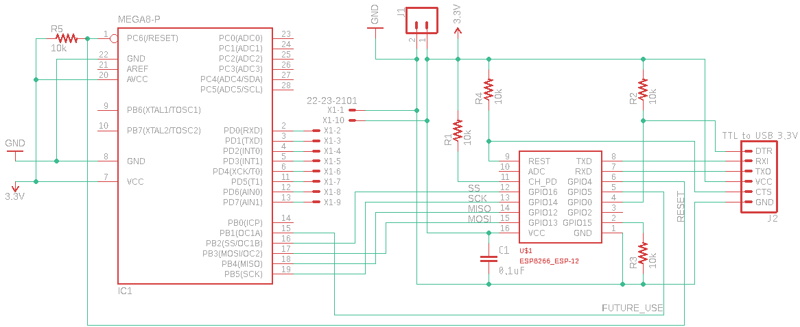

# Secure ESP8266 MQTT Client
*Copyright (c) 2019 Warren Taylor.  All right reserved.*

There are many tutorials on how to program the ESP8266 as an MQTT Client using the Arduino libraries. But it's hard to find a single source clearly describing how to program the ESP8266 as a **secure** MQTT Client. As a long time software engineer I know how important security is these days.

> This project uses the [ESP8266 Arduino Core](https://arduino-esp8266.readthedocs.io/) library and board specifications.

## Security First
At a high level of abstraction secure connections for ESP8266 devices are straight forward when using the arduino-esp8266 **BearSSL::WiFiClientSecure** class.
This is because the **BearSSL::WiFiClientSecure** class extends from the insecure arduino-esp8266 **WiFiClient** class.
What gets complicated is properly initializing a BearSSL::WiFiClientSecure object, which is what this project focuses on.
Once the secure initialization is done the remaining code is implemented mostly the same as the insecure **WiFiClient** class, of which there are many examples.

## ArduinoOTA
The ArduinoOTA library was initially used but later removed from this code because there did not appear to be sufficient resources in the ESP8266 to have a secure connection open by both the MQTT Broker and ArduinoOTA at the same time.
In the near future, Secure OTA will be implemented differently in order to coexist with Secure MQTT.

## Source Files

### secure_esp8266_mqtt_client.ino
This is the top level application source code that:
* Connects to the WAP (Wireless Access Point - a.k.a. Wifi Router).
* Securely connects to the MQTT Broker.
* Subscribes to the desired MQTT topics.
* Handles incoming MQTT messages.
* Controls ESP8266 Chip Level Data Pins.
* Configures and manages communications over SPI (Serial Peripheral Interface) with connected ATmega168.

### SetupWifi.cpp and SetupWifi.h
This **SetupWifi** class handles the security and encapsulates the arduino-esp8266 **BearSSL::WiFiClientSecure** object.
This class holds the ssid and password of the Wifi Router and implements the code to connect to that router.
This class also holds the ca_cert, client_cert, and client_key used to make secure connections using the **BearSSL::WiFiClientSecure** class.
These certificates and keys were generated when
[Creating the MQTT Keys and Certificates](https://github.com/tsi-software/Secure_ESP8266_MQTT_poc/tree/master/top-level-components/mqtt_server_setup#creating-the-mqtt-keys-and-certificates)
Another detail handled by this class, that is not at first obvious, is accurately setting the ESP8266 clock.
This is needed because security certificates can, and should, have an expiry date,
which are very important in order to prevent old and possibly compromised certificates from being reused.

### secure_credentials.h
This file contains a copy of the required certificates and keys that were generated when
[Creating the MQTT Keys and Certificates](https://github.com/tsi-software/Secure_ESP8266_MQTT_poc/tree/master/top-level-components/mqtt_server_setup#creating-the-mqtt-keys-and-certificates)
> Storing credentials in source code in considered both insecure and bad practice! One of the main reasons for this is because source code that is committed to your revision control system becomes openly accessible (the opposite of secure).
In a subsequent version of this project "secure_credentials.h" will be removed and
replaced with a method of securely injecting credentials into the target devices.

### AsyncWait.h
AsyncWait.h is code that is independent of security but still worth mentioning here.
One of my prime directives is to never write blocking code (code that waits for something to happen but also prevents any other code from executing).
AsyncWait allows me to write code in one place that waits for a duration of time but still allows the main loop() to continue processing.
I think I may write an entirely separate blog on this topic.

### Zones.h
This is application level code, which is independent of security and, therefore, not discussed here.

### globals.h
This is application level code, which is independent of security and, therefore, not discussed here.

### Schematics

## Future Features

### ESP8266 OTA
To Do ...

### AVR SPI Slave OTA
To Do ...

## MQTT Client References
<https://arduino-esp8266.readthedocs.io/en/latest/esp8266wifi/readme.html>
<https://arduino-esp8266.readthedocs.io/en/latest/esp8266wifi/bearssl-client-secure-class.html>
<https://github.com/esp8266/Arduino/blob/master/doc/esp8266wifi/bearssl-client-secure-class.rst>
<https://github.com/esp8266/Arduino/tree/master/libraries/ESP8266WiFi/examples>
<https://github.com/esp8266/Arduino/blob/master/libraries/ESP8266WiFi/src/WiFiClientSecureBearSSL.h>
<https://pubsubclient.knolleary.net/>

# Android - Secure MQTT Client Certificate setup
To Do ...
